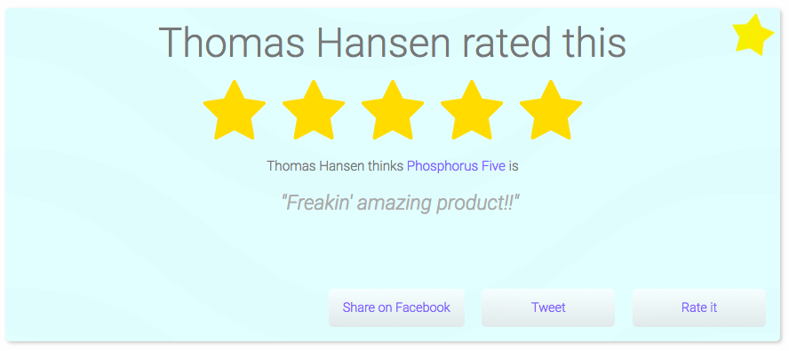

# The Harvester, a DTC marketing tool

The _"Harvester"_ allows you to collect your customer love, and display it for the whole world
to see - And in the process, collect your customers' email address, having an explicit __opt-in for direct email marketing__.

Basically, it allows your customers to rate the experience of your product/service, and afterwards sharing their
rating with their friends on Facebook or Twitter - But only if the rating is 3 or higher. If they rate your product/service
lower than 3, the system apologizes, and informs the user that _"an associate from your company will contact them to see if 
the problem can be fixed"_. As they rate your product/service, you're collecting their email address, with an explicit opt-in 
to do direct marketing towards them.

Below you can see the screenshot of the administrative dashboard for the system.

The administrative dashboard, allows you to export all ratings, and email addresses, to a CSV file, which can be easily
imported into for instance Vertical Response, or some other _"email blast"_ program of your choice.

As the customer gives his rating, an _"auto responder email"_ is automatically sent to him, giving him a link to his
rating, allowing him to confirm his email address. After the email address has been confirmed, it will be explicitly marked
as a _"confimed"_ email address in your dashboard. Allowing you to only market to customers who have actually confirmed their email
address.

When a person has rated your product/service, he is brought to a _"profile"_ page, which contains his comment, and rating - Allowing
him to share his rating on Facebook and/or Twitter - Facilitating for having your (happy) customers create a viral buzz around you,
and your service/product. Below is a screenshot of how this looks profile page looks like.

The system can be easily configured and installed on your own 
server, [read how here](https://gaiasoul.com/2017/10/03/harvest-love-from-your-customers/). We can also help you create your own profile for
the system. You can [try a live version of the system here](https://samples.gaiasoul.com/harvester), or by scanning the QR code below this
paragraph.

## Integrate it with your own QR code

The brilliance of the system truly comes to shine, once you combine it with e.g. a QR code at your own retail location. This allows
you to have all of your happy customers share how awesome you are, and how happy they are with your service/product - And such create
more customers for you and your shop. You can create your own QR code, linking to your own personal 
rater [here](http://www.qr-code-generator.com/) for instance.

Basically, it gives any _"mom and pop store"_ a billion dollars worth of marketing tools and infrastructure, and it's Free Software and 
Open Source! You can configure the system in 1 minute - It only requires a handful of (SMTP) settings for its _"auto responder"_ email 
settings, and nothing more.
