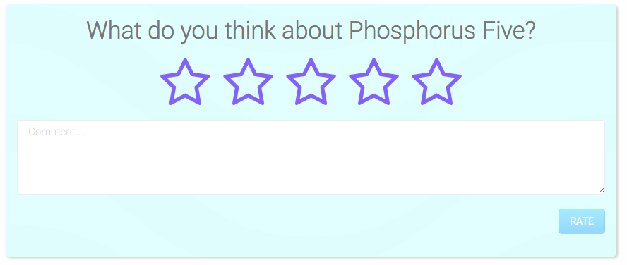
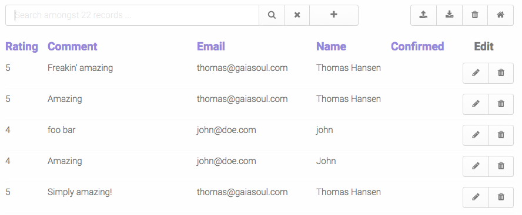

# The Harvester, a marketing tool for direct communication

The _"Harvester"_ allows you to collect your customer love, and display it for the whole world
to see it - And in the process, collect your customers' email address, having an opt-in for direct email marketing.

Basically, it allows your customers to rate the experience of your product/service, and afterwards sharing their
rating with their friends on Facebook or Twitter - But only if the rating is 3 or higher. If they rate your product/service
lower than 3, the system apologizes, and informs the user that _"an associate from your company will contact them to see if 
the problem can be fixed"_. As they rate your product/service, you're collecting their email address, with an explicit opt-in 
to do direct marketing towards them.

Below you can see the screenshot of the administrative dashboard for the system.

The administrative dashboard, allows you to export all ratings, and email addresses, to a CSV file, which can be easily
imported into for instance Vertical Response, or some other _"email blast"_ program of your choice.

